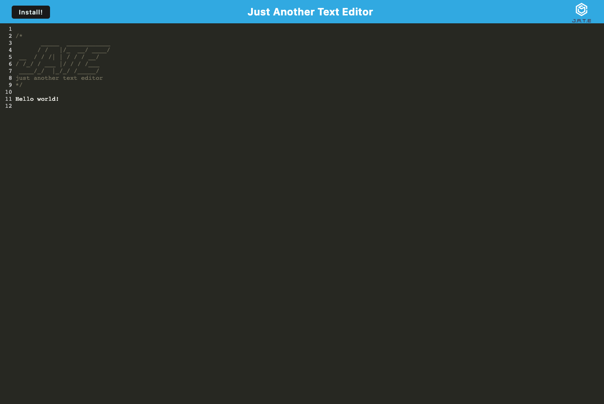

# Text Editor

## Table of Contents
* [Description](#description)
* [Installation instructions](#installation-instructions)
* [Usage Information](#usage-information)
* [License](#license)
* [Contribution Guidelines](#contribution-guidelines)
* [Test Instructions](#test-instructions)
* [Questions](#questions)

## Description
I built a text editor that runs in the browser. This is a single-page Progressive Web Application (PWA) and features a number of data persistence techniques that serve as redundancy in case one of the options is not supported by the browser. This application was built using HTML, CSS, and JavaScript for the front end, an Express Server for the backend, and Webpack for file bundling. The application also functions offline.

## Installation Instructions
Install Node.js before using this application.

## Usage Information

[Click here to check it out!](https://pure-everglades-02823.herokuapp.com/)

After opening the app, enter in some text. Your progress will be saved even after you close the app and reopen at a later point. This app is also downloadable as a PWA that you can access from your desktop!

## License
[MIT](https://opensource.org/licenses/MIT)

## Contribution Guidelines
N/A

## Test Instructions
N/A

## Questions
Have any addition questions? Contact me!
&nbsp;  
GitHub: [sprantis](https://github.com/sprantis)
&nbsp;
Email: sprantis@gmail.com
